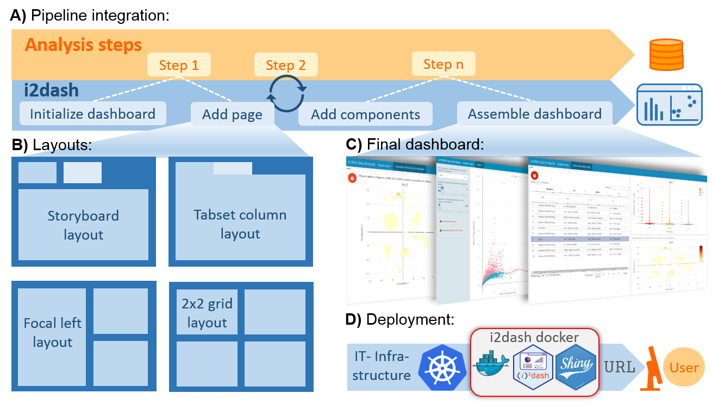

# Interactive & iterative dashboards in R

## Abstract 

Scientific communication and data visualization are important aspects to illustrate complex concepts and results from data analyses. The R package **i2dash** provides functionality to create customized, web-based dashboards for data presentation, exploration and sharing. **i2dash** integrates easily into existing data analysis pipelines and can organize scientific findings thematically across different pages and layouts.

### Main features

- Easy integration into existing analysis pipelines in R for programmatic dashboard creation
- Provides a selection of predefined layouts to arrange content
- Support for multiple components, such as htmlwidgets, tables, text, images etc.
- Creation of web-based, sharable, static or interactive dashboards
- Enables a flexible and iterative cycle of dashboard development



*(A) dashboard is initialized at the beginning of a data analysis pipeline. During the pipeline run, new content, results, or data visualizations are iteratively added to the dashboard’s pages. The final dashboard is rendered into a static or interactive document. (B) Pages added to the dashboard can be arranged in a flexible manner from a selection of predefined layouts. (C) Examples of programmatically created dashboards. (D) The i2dash docker container, providing all dependencies for interactive, shiny based apps, can be used to easily deploy individual data interpretations on a cloud infrastructure, such as Kubernetes, as a micro service.*

## Installation

The package can be installed with:

```
install.packages("i2dash")
```

## Where to start

-  [**Basics**]() This tutorial gives on overview over the core functions of **i2dash** and explains how you can build your first dashboard.

## Extension

It is possible to extend the core functionality of **i2dash** with templates for components and pre-defined pages. This enables to provide an enhanced user interactivity e.g. dynamic change of plot settings. Further, extensions allow an easier integration of complex calculations and data manipulation, hidden behind functions.

- [**i2dash.scrnaseq**](https://gitlab.gwdg.de/loosolab/software/i2dash.scrnaseq) enables an enhanced user interactivity and contains simple but effective tools for the creation of an i2dashboard with focus on single-cell RNA-sequencing data visualization and exploration.

## Run i2dash using Docker

At first, install [Docker](https://docs.docker.com/engine/install/). Then pull the image of **i2dash**:

`docker pull docker.gitlab.gwdg.de/loosolab/container/i2dash.deployment:r3.6.3_bioc3.10`

The next step is to run a container and simultaneously load the dashboard files (the `.Rmd` file and all files of the `datadir(dashboard)` directory) into the container. To mount custom data into the container, make use of Docker's `-v` parameter to mount a host directory into the container. Inside the container, **i2dash** looks for external datasets in `/srv/shiny-server/`. Use the following code, where you exchange `/path/to/dashboard/files` with the respective path to the directory containing the `.Rmd` file and all files of the `datadir(dashboard)` directory.

```docker run -d -p 3838:3838 -v '/path/to/dashboard/files':'/srv/shiny-server' docker.gitlab.gwdg.de/loosolab/container/i2dash.deployment:r3.6.3_bioc3.10```

Now, view the dashboard with your browser at `3838:3838`.

## How to cite

If you use **i2dash** or **i2dash.scrnaseq** in your work, please cite:

Ustjanzew A., Preussner J., Bentsen M., Kuenne C., and Looso M. i2dash: creation of flexible, interactive and web-based dashboards from data analysis pipelines. *tba* (2020)

## License

This project is licensed under the MIT license.

## FAQ

- **The Rmd file of the dashboard contains pages and components but after rendering the dashboard remains empty:** Make sure you have a current version of pandoc installed and view the dashboard only with a modern browser.
