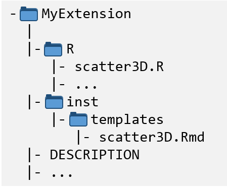
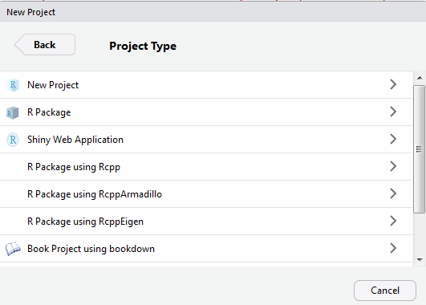
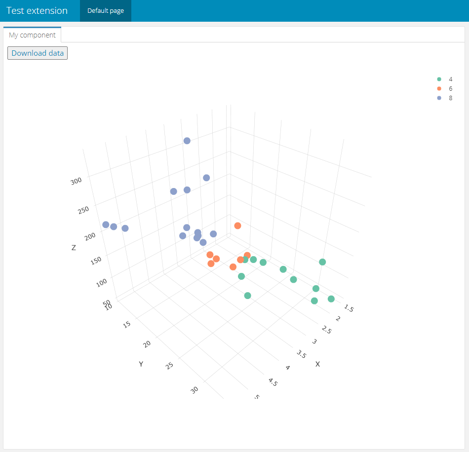

Vignette last complied on `r Sys.Date()`. i2dash is licenced under `r utils::packageDescription("i2dash")[["License"]]`.

```{r style, echo = FALSE, results = 'asis', include = FALSE}
BiocStyle::markdown()
```

```{r setup, include = FALSE}
knitr::opts_chunk$set(
    collapse = TRUE,
    comment = "#>",
    error = FALSE,
    warning = FALSE,
    message = FALSE
)
stopifnot(requireNamespace("htmltools"))
htmltools::tagList(rmarkdown::html_dependency_font_awesome())

library(magrittr)
```


# Introduction and scope

i2dash allows to programmatically generate interactive and flexible web-based dashboards. At its heart, the `i2dashboard` class acts as the basic framework for managing metadata, input and pages. 
Currently i2dash supports plain text, images, R objects, such as HTML widgets, and functions as input. Such functions can be used to generate fully customized dashboard content, for example very specific and customizable visualizations. This allows data from specific disciplines to be visualized in a targeted manner and component functionality to be adapted to the needs of different users. Thus we used the principle to develop extensions shown below and created the package [i2dash.scrnaseq](https://loosolab.github.io/i2dash.scrnaseq/), which allows the visualization and exploration of single-cell RNA-seq data.

Besides flexibility, advantages of using functions are their reusability, the possibility to implement interactivity and the possibility to extend to entire pages. 

In this vignette we will show how to extend the functionality of i2dash. We will develop a reusable component, that contains an interactive 3D scatter plot. In the 'interactive' mode of the dashboard the user can additionally select the data plotted on the axes. We chose to implement the extension in its own R package, which allows good code organization and easy sharing with others.

```{r fig-1, fig.cap = "Figure 1: Final customized and reusable component with Shiny input widgets.", eval = TRUE, echo = FALSE}
knitr::include_graphics("./images/scatter3D_result_shiny.png")
```

## Availability

The directories, files and code created during this vignette is also available for download from [our S3 storage](https://s3.mpi-bn.mpg.de/data-i2dash-2020/MyExtension.zip).

## Directory structure

For the new extension, we set up a directory structure of a source package (if you want to learn more about package structure, see [here](https://r-pkgs.org/package-structure-state.html)). 

In figure 2 you can see that the folder 'MyExtension' contains subfolders 'R', 'inst', and 'man'. The 'R' folder contains the R scripts and functions. The Rmarkdown template of our component is stored under 'MyExtension/inst/templates/'. Further the folder 'MyExtension' contains important metadata files, e.g. 'DESCRIPTION'.

```{r fig-2, fig.cap = "Figure 2: Directory structure for an extension R package.", eval = TRUE, echo = FALSE}

```

The easiest way to create the desired structure in RStudio is to click **File** -> **New Project**. In the dialog we select **New Directory**, then **R Package**.

```{r fig-3, fig.cap = "Figure 3: ....", eval = TRUE, echo = FALSE}
knitr::include_graphics("./images/RStudio_new_project.png")
```

```{r fig-4, fig.cap = "Figure 4: .....", eval = TRUE, echo = FALSE}

```

To conclude, we set a package name, select the directory, where the new package structure will be created and click on **Create Project**.

```{r fig-5, fig.cap = "Figure 5: ....", eval = TRUE, echo = FALSE}
knitr::include_graphics("./images/RStudio_new_project3.png")
```

RStudio creates the directory and several metadata files. To make this directory look like the one in figure 2, we delete the file 'hello.R' from the 'R' folder and create the subfolder 'templates' under 'inst'.

## Dependencies & reexport of magrittr pipe operators

In the further course of this tutorial we need to install the following packages:

```{r, eval=FALSE}
install.packages(c("i2dash","magrittr","dplyr","assertive.types","plotly"))
```

Also, we need to create the file 'reexports.R' and reexport the pipe-operators of the magrittr package. In the 'reexports.R' file we write the following code:

```{r, eval=FALSE}
#' magrittr forward-pipe operator
#'
#' See \code{\link[magrittr]{\%>\%}}.
#' @name %>%
#' @importFrom magrittr %>%
#' @export %>%
NULL

#' magrittr forward-backward-pipe operator
#'
#' See \code{\link[magrittr]{\%<>\%}}.
#' @name %<>%
#' @importFrom magrittr %<>%
#' @export %<>%
NULL
```

## Concept of extensibility

The ability of i2dash to generate R Markdown code can be extended with additional packages. Figure 6 demonstrates the concept of extensibility. In order to develop a component or a page with a pre-defined layout and specific composition of components as an extension, the developer needs to provide a method and an R Markdown template. The method takes the i2dashboard object and the data relevant for the component. It validates and stores the data in a suitable data structure in a file (e.g. RDS file). Furthermore the method generates an R Markdown string based on a template for the component or page and extends the i2dashboard object.

```{r fig-6, fig.cap = "Figure 6: Concept of extending i2dash.", eval = TRUE, echo = FALSE}
knitr::include_graphics("./images/concept1.png", error = FALSE)
```

Figure 7 shows this principle applied to our objectives. The method 'scatter3D' will be stored in the 'scatter3d.R' file. When the user applies this method, to add the component to his dashboard, the method will use the Rmarkdown template stored in the file 'scatter3D.R' to generate the component. 

```{r fig-7, fig.cap = "Figure 7: Our example project applied to this concept.", eval = TRUE, echo = FALSE}
knitr::include_graphics("./images/concept2.png", error = FALSE)
```

# Main function

Now we create a new file 'scatter3D.R' and write the function that evaluates the input and saves it in an .Rds file for this component. The input for this function is:

- **i2dashboard**: the i2dashboard class object to add the component.
- **x**, **y**, **z**, **colour**: This is the data used to plot in the graph. The user can provide nuemric vectors or data.frames. If data.frames are provided, the columns are the possible selection options in the Shiny dropdown menues.
- **title**, **x_title**, **y_title**, **z_title**: With these parameters the dashboard creator can further customize the component. These parapeters are optional and should be characters.

```{r, eval=FALSE}
#' Validate the data and create a Rmd string of a component containing a 3D scatter plot.
#'
#' @param i2dashboard The i2dashboard class object.
#' @param x Numeric observations mapped to the x-axis (numeric vector or data.frame).
#' @param y Numeric observations mapped to the y-axis (numeric vector or data.frame).
#' @param z Numeric observations mapped to the z-axis (numeric vector or data.frame).
#' @param x_title The title of the x-axis.
#' @param y_title The title of the y-axis.
#' @param z_title The title of the z-axis.
#' @param colour The title of the y-axis.
#' @param title The title of the component
#'
#' @return An Rmarkdown sting for the rendered component.
#' @export
scatter3D <- function(i2dashboard, x, y, z, colour = NULL, x_title = NULL, y_title = NULL, z_title = NULL, title = NULL){
  # see contetent below 
}

```

Inside the function, we need to validate the input: 

```{r, eval=FALSE}
  library(assertive.types)
  library(dplyr)

  # validate required parameters

  # convert vectors to data.frames:
  if(is.numeric(x)) x <- data.frame(X = x)
  if(is.numeric(y)) y <- data.frame(Y = y)
  if(is.numeric(z)) z <- data.frame(Z = z)
  if(is.character(colour) | is.numeric(colour) | is.factor(colour)) colour <- data.frame("colour" <- colour)

  assertive.types::assert_is_data.frame(x)
  assertive.types::assert_is_data.frame(y)
  assertive.types::assert_is_data.frame(z)

  # select columns only containing numeric or integer values
  x %<>%
    as.data.frame() %>%
    dplyr::select_if(function(col) is.integer(col) | is.numeric(col))
  y %<>%
    as.data.frame() %>%
    dplyr::select_if(function(col) is.integer(col) | is.numeric(col))
  z %<>%
    as.data.frame() %>%
    dplyr::select_if(function(col) is.integer(col) | is.numeric(col))

  # provide column names
  if(is.null(colnames(x))) colnames(x) <- paste0("X_", 1:ncol(x))
  if(is.null(colnames(y))) colnames(y) <- paste0("Y_", 1:ncol(y))
  if(is.null(colnames(z))) colnames(z) <- paste0("Z_", 1:ncol(z))

  # check correct dimensions
  if(nrow(x) != nrow(y)) stop("The number of rows in 'x' and 'y' is not equal.")
  if(nrow(x) != nrow(z)) stop("The number of rows in 'x' and 'z' is not equal.")

  # validate optional parameters
  if(!is.null(colour)){
    assertive.types::assert_is_data.frame(colour)
    colour %<>%
      as.data.frame() %>%
      dplyr::select_if(function(col) is.integer(col) | is.numeric(col) | is.factor(col))
    if(is.null(colnames(colour))) colnames(colour) <- paste0("Color_", 1:ncol(colour))
    if(nrow(x) != nrow(colour)) stop("The number of rows in 'x' and 'colour' is not equal.")
  }
  # check titles
  if(!is.null(title)) assertive.types::is_character(title)
  if(!is.null(x_title)) assertive.types::is_character(x_title)
  if(!is.null(y_title)) assertive.types::is_character(y_title)
  if(!is.null(z_title)) assertive.types::is_character(z_title)
```

Then the input is saved into an .Rds file. The `title` of the component as well as the `env_id` are not saved and will be provided as characters by knitting the template. 

```{r, eval=FALSE}
  # Create random env id
  env_id <- paste0("env_", stringi::stri_rand_strings(1, 6, pattern = "[A-Za-z0-9]"))

  # Create component environment and save as .rds file
  env <- new.env()
  env$x <- x
  env$y <- y
  env$z <- z
  env$colour <- colour
  env$x_title <- x_title
  env$y_title <- y_title
  env$z_title <- z_title

  saveRDS(env, file = file.path(i2dashboard@datadir, paste0(env_id, ".rds")))
```

The 'scatter3D' function saves the data in an environment file and uses the 'scatter3D.Rmd' template to render the R Markdown string i.e. replacing the placeholders in the template. In this case, the placeholder {{ title }} is replaced by the provided title string and {{ env_id }} is replaced by the random generated ID used for naming of the saved environment file. 

At the end of the function we return the rendered R markdown string of the component. 

```{r, eval=FALSE}
  # Generate the Rmarkdown string of the component based on the template
  timestamp <- Sys.time()
  expanded_component <- knitr::knit_expand(
    file = system.file("templates", "scatter3D.Rmd", package = "MyExtension"),
    title = title,
    env_id = env_id,
    date = timestamp)
  return(expanded_component)
```

# Template of the component

In the next step, we create an Rmarkdown template file of the scatter3D component under 'inst/templates/scatter3D.Rmd'. At the top of this document the 'title' in curved brackets will be replaced by the provided title during knitting. Also the 'env_id' will be replaced and the correct .rds file will be read in. 'is_shiny' contains a logical whether the i2dashboard is interactive and should use shiny or not. Whether the dashboard is interactive or not is defined by the dashboard creator during the initialisation of the dashboard (the parameter `interactive` of the `i2dash::i2dashboard()` function).
This is the first code chunk of the 'scatter3D.Rmd' file: 

```{r, echo = FALSE}
r_chunk <- "```"
htmltools::HTML(paste0(
  "<pre><code>
### {{ title }}

",r_chunk,"{r}
{{ env_id }} <- readRDS(file.path(datadir, '{{ env_id }}.rds'))
is_shiny <- identical(knitr::opts_knit$get('rmarkdown.runtime'), 'shiny')
library(magrittr)
",r_chunk,"
</code></pre>")
)
```

## The static mode

In this section, we will write the code chunk responsible for the static mode of the dashboard. The plotly plot will be interactive but there are no drop-down selections for selecting the data. The first column of each input data.frame (**x**, **y**, **z**, **colour**) will be used as the data for the 3D scatter plot.

```{r fig-8, fig.cap = "Figure 8: ....", eval = TRUE, echo = FALSE}

```

The following R code chunk is also in the same file `scatter3D.Rmd`. This code chunk will be executed, if Shiny is not used.

All variables we define in this code chunk should be unique. This is made possible by using the env_id in the curved brackets. During the knitting process, `{{ env_id }}` will be replaced by the 'real' env_id and the variable names will be valid in the final R markdown string. Therefore, we can ignore RStudio warnings.

First we set the variables for `x`, `y`, `z`, `x_title`, `y_title`, and `z_title`. If the user had not provided his own titles, the names of the first column of `x`, `y` and `z` are used as the titles. If `colour` was provided the first column will be used as the input vector.

Next, the plotly chart is created by the `plotly::plot_ly()` function. Finally a data.frame is created, that will be then provided as download.

```{r, echo = FALSE}
r_chunk <- "```"
htmltools::HTML(paste0(
  "<pre>
",r_chunk,"{r, eval=!is_shiny}
# set variables 
# the first column is always used
x_{{ env_id }} <- {{ env_id }}$x[,1]
y_{{ env_id }} <- {{ env_id }}$y[,1]
z_{{ env_id }} <- {{ env_id }}$z[,1]
if(!is.null({{ env_id }}$x_title)) x_title_{{ env_id }} <- {{ env_id }}$x_title else x_title_{{ env_id }} <- colnames({{ env_id }}$x)[1]
if(!is.null({{ env_id }}$y_title)) y_title_{{ env_id }} <- {{ env_id }}$y_title else y_title_{{ env_id }} <- colnames({{ env_id }}$y)[1]
if(!is.null({{ env_id }}$z_title)) z_title_{{ env_id }} <- {{ env_id }}$z_title else z_title_{{ env_id }} <- colnames({{ env_id }}$z)[1]
if(!is.null({{ env_id }}$colour)) colour_{{ env_id }} <- {{ env_id }}$colour[,1] else colour_{{ env_id }} <- NULL

# creating the plot object
plot_{{ env_id }} <- plotly::plot_ly(
  x = x_{{ env_id }}, 
  y = y_{{ env_id }}, 
  z = z_{{ env_id }}, 
  color = colour_{{ env_id }}) %>%
  plotly::add_markers() %>% 
  plotly::layout(scene = list(
    xaxis = list(title = x_title_{{ env_id }}),
    yaxis = list(title = y_title_{{ env_id }}),
    zaxis = list(title = z_title_{{ env_id }})
  ))

# Provide data for download
if(is.null(colour_{{ env_id }})){
  df_{{ env_id }} <- data.frame(x = x_{{ env_id }}, 
                                y = y_{{ env_id }}, 
                                z = z_{{ env_id }})
} else {
  df_{{ env_id }} <- data.frame(x = x_{{ env_id }}, 
                                y = y_{{ env_id }}, 
                                z = z_{{ env_id }},
                                colour = colour_{{ env_id }})
}
htmltools::div(style='display:block;float:left;width:100%;height:90%;',
  htmltools::tags$button(i2dash::embed_var(df_{{ env_id }})), 
  plot_{{ env_id }}
)
",r_chunk,"
</pre>")
)
```

### Installing & testing the static mode

Since we now have a lot of code, it makes sense to test if everything works so far. To do this we first have to generate the documentation of the package with the function `devtools::document()`. and then we install the package with `devtools::install()`. 

```{r, eval=FALSE}
devtools::document(".")
devtools::install(".", quick = TRUE)
```

In a separate R file we create an i2dashboard object, add our component with `add_component()`, define the input and assemble the dashboard to a Rmarkdown file. If these steps have thrown no errors, half of our project has succeeded.

If we can open the newly generated file 'MyDashboard.Rmd' in RStudio and then view its contents in a web browser, this means that the template code also works. (Unfortunately, the 3D scatter plot of plotly is not displayed in the RStudio Viewer, so we need to view the file in the browser.)

```{r, eval=FALSE}
library(magrittr)
library(i2dash)

# Create i2dashboard object
# & add the component to the default page
MyDashboard <- i2dashboard(
  title= "Test extension",
  datadir = ".",
  interactive = FALSE
) %>% add_component(
  component = MyExtension::scatter3D,
  x = mtcars$mpg,
  y = mtcars$wt,
  z = mtcars$hp,
  colour = as.factor(mtcars$cyl),
  title = "My component")

# Assemble the dashboard
assemble(MyDashboard, file = "MyDashboard.Rmd")
```

## The interactive mode with R Shiny

By adding Shiny to a flexdashboard, we create a dashboard that enables the user to change underlying parameters and see the results immediately. In our case we provide the possibility to select the values that should be mapped to the x-, y- and z-axis as well as the values, that should be used for the colouring. 

A Shiny application consists of two parts, a user interface (UI) function, and a server function. The UI determines the structure and layout of the application and
can contain HTML elements or input widgets for user-application interaction. Shiny also provides a group of functions that convert R objects into output widgets that are displayed on the UI. The server function defines the server-side logic of the Shiny application and is the "live" connection between input values on the client and outputs generated on the web server. The server function contains functions that map user inputs to various kinds of output.

In a flexdashboard the code for the UI as well as the server code can be used within the same code chunk.The webpage of flexdashboard provides a good description how to use Shiny with flexdashboard (see [here](https://rmarkdown.rstudio.com/flexdashboard/shiny.html)).

```{r fig-9, fig.cap = "Figure 9: Final customized and reusable component with Shiny input widgets.", eval = TRUE, echo = FALSE}
knitr::include_graphics("./images/scatter3D_result_shiny.png")
```

First we create Shiny `selectInput()` widgets if the target data.frame has more than one column. Also a download button will be provided, so the user can download the data that is used for the created plot. 

We handle the inputs by creating a reactive expression for each data.frame. Inside the reactives it is checked, if the data.frame has more than one column. If this is the case, the input values from the `selectInput()` widgets should be used. 

Then a `downloadHandler()` creates a data.frame containing the currently selected x, y, z and colour values for the download. 

Plotly's function `renderPlotly()` outputs and renders a plotly object (generatet by the function `plotly::plot_ly()`) within Shiny. Finally, the UI elements are stored in a dropdown menu created with the package [shinyWidgets](https://github.com/dreamRs/shinyWidgets).

```{r, echo = FALSE}
r_chunk <- "```"
htmltools::HTML(paste0(
  "<pre>
",r_chunk,"{r, eval=is_shiny}
#
# shiny input widgets
#
ui_list <- list()

# shiny input widget for x
if (ncol({{ env_id }}$x) > 1){
  ui_list <- rlist::list.append(ui_list,
                                selectInput('input_x_{{ env_id }}', label = 'Select data for x axis:',
                                            choices = colnames({{ env_id }}$x)))
}

# shiny input widget for y
if (ncol({{ env_id }}$y) > 1){
  ui_list <- rlist::list.append(ui_list,
                                selectInput('input_y_{{ env_id }}', label = 'Select data for y axis:',
                                            choices = colnames({{ env_id }}$y)))
}

# shiny input widget for size
if (ncol({{ env_id }}$z) > 1){
  ui_list <- rlist::list.append(ui_list,
                                selectInput('input_z_{{ env_id }}', label = 'Select data for the z axis:',
                                            choices = colnames({{ env_id }}$z)))
}

# shiny input widget for colour_by
if (!is.null({{ env_id }}$colour)){
  if(ncol({{ env_id }}$colour) > 1)
  ui_list <- rlist::list.append(ui_list,
                                selectInput('input_colour_{{ env_id }}', label = 'Select metadata for colouring:',
                                            choices = colnames({{ env_id }}$colour)))
}

#
# shiny download button
#
ui_list <- rlist::list.append(ui_list, tags$div(tags$br(), downloadButton('downloadData_{{ env_id }}', 'Download data')))

#
# Handle inputs
#
x_{{ env_id }} <- shiny::reactive({
  if(ncol({{ env_id }}$x) == 1){
    data <- {{ env_id }}$x[[1]]
    title <- colnames({{ env_id }}$x)[1]
    return(list(data = data, title = title))
  } else {
    data <- {{ env_id }}$x[[input$input_x_{{ env_id }}]]
    title <- input$input_x_{{ env_id }}
    return(list(data = data, title = title))
  }
})

y_{{ env_id }} <- shiny::reactive({
  if(ncol({{ env_id }}$y) == 1){
    data <- {{ env_id }}$y[[1]]
    title <- colnames({{ env_id }}$y)[1]
    return(list(data = data, title = title))
  } else {
    data <- {{ env_id }}$y[[input$input_y_{{ env_id }}]]
    title <- input$input_y_{{ env_id }}
    return(list(data = data, title = title))
  }
})

z_{{ env_id }} <- shiny::reactive({
  if(ncol({{ env_id }}$z) == 1){
    data <- {{ env_id }}$z[[1]]
    title <- colnames({{ env_id }}$z)[1]
    return(list(data = data, title = title))
  } else {
    data <- {{ env_id }}$z[[input$input_z_{{ env_id }}]]
    title <- input$input_z_{{ env_id }}
    return(list(data = data, title = title))
  }
})

colour_{{ env_id }} <- shiny::reactive({
  if(!is.null({{ env_id }}$colour)){
    if(ncol({{ env_id }}$colour) == 1){
      return({{ env_id }}$colour[[1]])
    } else {
      return({{ env_id }}$colour[[input$input_colour_{{ env_id }}]])
    }
  } else {
    return(NULL)
  }
})

#
# Download data.frame
#
output$downloadData_{{ env_id }} <- downloadHandler(
  filename =  paste('data-', Sys.Date(), '.csv', sep=''),
  content = function(file) {
    if(is.null(colour_{{ env_id }}()$colour)){
      df <- data.frame(
        x = x_{{ env_id }}()$data, 
        y = y_{{ env_id }}()$data, 
        z = z_{{ env_id }}()$data)
    } else {
      df <- data.frame(
        x = x_{{ env_id }}()$data, 
        y = y_{{ env_id }}()$data, 
        z = z_{{ env_id }}()$data, 
        colour = colour_{{ env_id }}())
    }
    write.csv(df, file)
  }
)

#
# reactive for plot creation
#
output$plot_{{ env_id }} <- plotly::renderPlotly({
  if(!is.null({{ env_id }}$y_title)) y_title <- {{ env_id }}$y_title else y_title <- y_{{ env_id }}()$title
  if(!is.null({{ env_id }}$x_title)) x_title <- {{ env_id }}$x_title else x_title <- x_{{ env_id }}()$title
  if(!is.null({{ env_id }}$z_title)) z_title <- {{ env_id }}$z_title else z_title <- z_{{ env_id }}()$title

  plotly::plot_ly(
  x = x_{{ env_id }}()$data, 
  y = y_{{ env_id }}()$data, 
  z = z_{{ env_id }}()$data, 
  color = colour_{{ env_id }}()) %>%
  plotly::add_markers() %>% 
  plotly::layout(scene = list(
    xaxis = list(title = x_title),
    yaxis = list(title = y_title),
    zaxis = list(title = z_title)
  ))
})

#
# Layout of component
#
shiny::fillRow(flex = c(NA, 1),
      shinyWidgets::dropdownButton(div(style='max-height: 350px; overflow-x: auto;',do.call(shiny::inputPanel, ui_list)),
                       circle = TRUE, status = 'danger', icon = icon('gear'), width = '300px',
                       tooltip = shinyWidgets::tooltipOptions(title = 'Click, to change plot settings:'))
      ,
      plotly::plotlyOutput('plot_{{ env_id }}', height = '100%')
)
",r_chunk,"</pre>")
)
```

### Installing & testing the interactive mode

To test the functionality we have to install the package with devtools as before.

```{r, eval=FALSE}
devtools::document(".")
devtools::install(".", quick = TRUE)
```

Then we create a new i2dashboard object and add our component to it. This time we pass data.frames as input to the single parameters instead of single numeric vectors. Once the addittion and assemble steps are accomplished, we can open the Rmarkdown document and use RStudio's "Run Document" button to render the file. In the web browser we should see the result, which is similar to the one in figure 1.

```{r, eval=FALSE}
library(magrittr)
library(i2dash)

# Create i2dashboard object
# & add the component to the default page
MyDashboard <- i2dashboard(
  title= "Test extension",
  datadir = ".",
  interactive = TRUE
) %>% add_component(
  component = MyExtension::scatter3D,
  x = mtcars,
  y = mtcars,
  z = mtcars,
  colour = as.factor(mtcars$cyl),
  title = "My component")

# Assemble the dashboard
assemble(MyDashboard, file = "MyDashboard.Rmd")
```

# Session Info {.unnumbered}

```{r sessioninfo}
sessionInfo()
```
