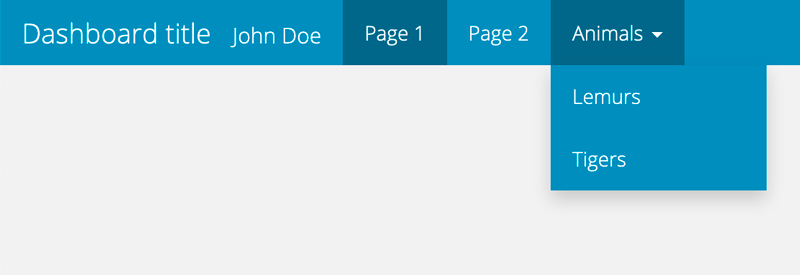
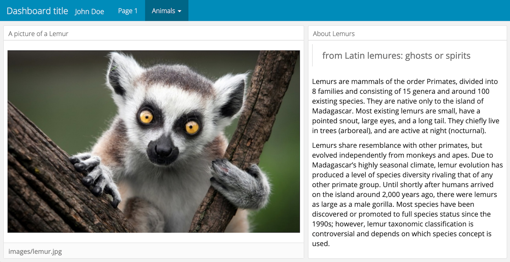
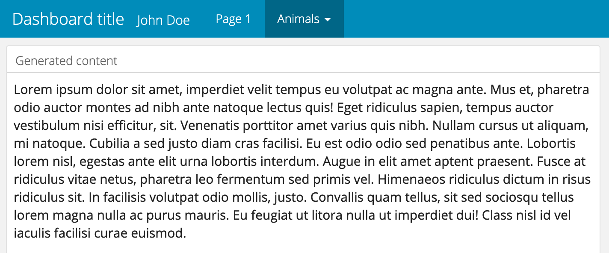
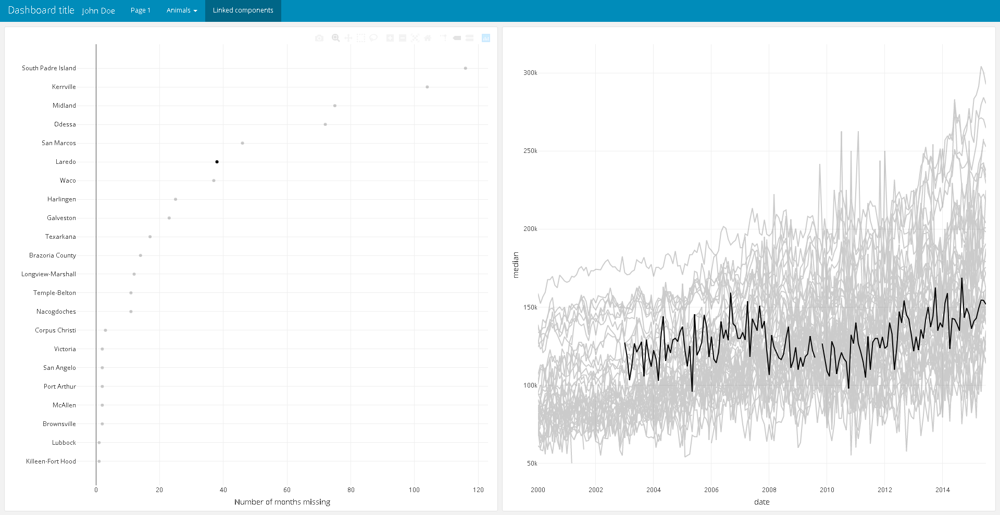

Vignette last complied on `r Sys.Date()`. i2dash is licenced under `r utils::packageDescription("i2dash")[["License"]]`.

```{r style, echo = FALSE, results = 'asis', include = FALSE}
BiocStyle::markdown()
```

```{r setup, include = FALSE}
knitr::opts_chunk$set(
    collapse = TRUE,
    comment = "#>",
    error = FALSE,
    warning = FALSE,
    message = FALSE
)
stopifnot(requireNamespace("htmltools"))
htmltools::tagList(rmarkdown::html_dependency_font_awesome())

library(magrittr)
```


# Introduction and scope

Scientific communication and data visualization are important aspects to illustrate complex concepts and results from data analyses. [R Markdown](https://rmarkdown.rstudio.com) enables weaving together narrative text and code into rich and reproducible documents, that can also run interactive widgets from [R Shiny](https://shiny.rstudio.com/).
R Studio's [Flexdashboard](https://rmarkdown.rstudio.com/flexdashboard/) introduces dashboards to publish a group of related data visualizations, tables, images and narrative text in row and column-based layouts. Both, R Markdown and R Studio's Flexdashboard require authors to manually create Markdown documents and assemble content at the right position in the file.
The R package i2dash provides classes and functionality to programatically create customized, web-based flexdashboards for data presentation, exploration and sharing. Dashboard content is organised in so-called **components** and can be added iteratively to the dashboard, *i.e.* as data or visualizations become available along the analysis pipeline. Components are reusable and can be distributed across different dashboard **pages** to organize scientific findings thematically. Ultimately, i2dash enables xxx and therefore integrates well into existing data analysis pipelines.

## Installation

The package can be installed with the `r BiocStyle::CRANpkg("remotes")` library:

```{r, eval=FALSE}
install.packages("i2dash", dependencies = TRUE)
```

or the development version:

```{r, eval=FALSE}
remotes::install_git(url = "https://gitlab.gwdg.de/loosolab/software/i2dash.git", repos = BiocManager::repositories())
```

Once installed, the package can be loaded and attached to your current workspace as follows:

```{r, eval=TRUE}
library(i2dash)
```

For this tutorial we need to install the following packages:
```{r, eval=FALSE}
install.packages(c("leaflet", "plotly", "ggplot2", "RColorBrewer"))
```

# Working with i2dash

## Creating a dashboard

i2dash introduces a new S4 class called `i2dashboard`. We start by creating an instance of the `i2dashboard` class and set some relevant parameters:

- `title` - the dashboard's title, as it will appear in the left corner of the navigation bar.
- `author`- the name of the dashboard author, it will also appear in the navigation bar.
- `interactive` - if set to `TRUE` a shiny-based dashboard will be created, otherwise a static HTML file.
- `theme` - changes the appearance of the dashboard. A variety of themes are available at [R Studio's Flexdashboard](https://rmarkdown.rstudio.com/flexdashboard/using.html#appearance) or [Semantic UI forest](https://semantic-ui-forest.com/themes/).
- `datadir` - defines the directory where dashboard files are stored.

```{r, eval=TRUE}
i2dashboard(
  title = "Dashboard title",
  author = "John Doe",
  interactive = FALSE,
  theme = "yeti") -> dashboard
```

We can examine the `i2dashboard` object by calling the object. The output shows the title of the dashboard, the number of saved pages and the number of components the page contains. By default the `i2dashboard` object contains the 'default' page without any components. 

```{r, eval=TRUE}
dashboard
```

With several accessor methods, it is also possible to change the slots `interactive`, `author`, `theme`, `datadir` and `title` of the `i2dashboard` object retrospectively:

```{r, eval=FALSE}
interactivity(dashboard) <- TRUE
datadir(dashboard) <- getwd()
theme(dashboard) <- "cosmo"
author(dashboard) <- "John Doe, MaxMustermann"
title(dashboard) <- "New dashboard title"
```

## Adding and removing pages

We next use the `add_page()` function to add two pages to the `dashboard` object. The first argument (`page`) sets an unique page identifier that will be used later to add components to it. The `title` defines a title of the page, which is shown in the navigation bar.

```{r, eval=TRUE}
dashboard %<>% 
  add_page(
    page = "page1",
    title = "Page 1",
    layout = "focal_left",
    menu = NULL) %>%
  add_page(
    page = "page2",
    title = "Page 2",
    layout = "focal_left",
    menu = NULL)
```

We can use the `menu` parameter to group several pages under a common drop-down menu: 

```{r, eval=TRUE}
dashboard %<>% 
  add_page(
    page = "page3",
    title = "Lemurs",
    layout = "focal_left",
    menu = "Animals") %>%
  add_page(
    page = "page4",
    title = "Tigers",
    layout = "focal_left",
    menu = "Animals")
```

```{r fig-1, fig.cap = "Figure 1: Navigation bar of the dashboard after adding several pages.", eval = TRUE, echo = FALSE}

```

We can remove a page using the `remove_page()` function. The `page` argument contains the unique page identifier of the page to be removed.

```{r, eval = TRUE}
dashboard %<>%
  remove_page(page = "page2")
```

## Adding content

Content can be added to pages using **components**. A component can be a R object itself (*e.g.* a widget from [htmwlwidgets](https://gallery.htmlwidgets.org/)), a file path (*e.g.* to a markdown or image file) or a function that can be called to generate content. We'll use the `add_component` function to explore several options and fill `page1` iteratively with three R objects:

```{r, eval=TRUE}
library(leaflet)
leaflet() %>%
  addTiles() %>%  
  addMarkers(lng=174.768, lat=-36.852,
             popup="The birthplace of R") -> leaftlet_map

dashboard %<>%
  add_component(leaftlet_map,
                page = "page1",
                title = "A map from leaflet")

library(plotly)
plot_ly(mtcars, x = ~wt, y = ~mpg) -> plotly_object

library(ggplot2)
mtcars %>%
  ggplot(aes(x=mpg)) +
  geom_density(fill="darkgrey") -> ggplot2_object

dashboard %<>%
  add_component(plotly_object,
                page = "page1",
                title = "A plot from plotly") %>%
  add_component(ggplot2_object,
                page = "page1",
                title = "A plot from ggplot2")
```

This results in the following dashboard:

```{r fig-2, fig.cap = "Figure 2: The resulting page with three components added after assembly of the dashboard.", eval = TRUE, echo = FALSE}
knitr::include_graphics("./images/example_page1.png")
```

### Adding text and images

Text and images can be added to a **page** by calling the `add_component` function with a file path. The function will include file paths ending with `.[png|jpg|jpeg|gif]` as image content, and other files as text content:

```{r, eval = TRUE}
# download the image & text or use the files in the package
dir.create("images")
dir.create("texts")
img <- "http://www.desktopimages.org/pictures/2014/1010/1/orig_76044.jpg"
download.file(img,'images/lemur.jpg', mode = 'wb')
text <- readLines("https://en.wikipedia.org/wiki/Lemuriformes")
cat(text[262],file="texts/lemurs.md",sep="\n")

dashboard %<>%
  add_component(file.path("images/lemur.jpg"),
                page = "page3",
                title = "A picture of a Lemur") %>%
  add_component(file.path("texts/lemurs.md"),
                page = "page3",
                title = "About Lemurs")
```

This results in the following dashboard:

```{r fig-3, fig.cap = "Figure 3: The resulting page with an image and text from a file.", eval = TRUE, echo = FALSE}

```

### Adding content from functions

Near unlimited flexibility comes from the ability to pass functions to `add_component`. Functions can be used to *generate* content based on their parameters when they're called. Lets create such a function:

```{r, eval = TRUE}
text_generator <- function(dashboard, n) {
  stringi::stri_rand_lipsum(nparagraphs = n) %>%
    paste(collapse = "\n\n") -> content
  paste0("### Generated content\n\n", content)
}
```

The function `text_generator` from above can generate `n` paragraphs of Lorem Ipsum upon calling. We can include it's return as content:

```{r, eval = TRUE}
dashboard %<>%
  add_component(text_generator,
                page = "page4",
                n = 4)
```

When writing your own generating functions, please keep it mind to set the `title` of the component within the function: 

```{r fig-4, fig.cap = "Figure 4: The resulting page with content generated from a function.", eval = TRUE, echo = FALSE}

```

### Linking components

The linking of several components enables an improvement in the communication of the structure of high-dimensional data. When linking several components, the data of the two visualizations are connected to each other by queries. Thus the interactive manipulation, e.g. selecting data points, of a component is transferred to the associated component.The package `plotly` enables us to link plotly charts in a client-side way (i.e., no special web server or callback to R is required). The following example demonstrates, how to link two plots together by using plotly. [Here](https://plotly-r.com/client-side-linking.html) you can find a detailed explanation and further examples of the clint-sided linkink mechanism of `plotly`. 


First, we load the data and create an object of class `crosstalk::SharedData` with the function `highlight_key`. This enables to query the data.

```{r, eval = TRUE}
# load the `txhousing` dataset
data(txhousing, package = "ggplot2")

# declare `city` as the SQL 'query by' column
tx <- highlight_key(txhousing, ~city)
```

Next, we initiate a plotly object (`base`) with the data object. And create two further plots (`time_series` and `dot_plot`) based on the new plotly object.

```{r, eval = TRUE}
# initiate a plotly object
base <- plot_ly(tx, color = I("black")) %>%
  group_by(city)

# create a time series of median house price
time_series <- base %>%
  group_by(city) %>%
  add_lines(x = ~date, y = ~median)

dot_plot <- base %>%
  summarise(miss = sum(is.na(median))) %>%
  filter(miss > 0) %>%
  add_markers(
    x = ~miss,
    y = ~forcats::fct_reorder(city, miss),
    hoverinfo = "x+y"
  ) %>%
  layout(
    xaxis = list(title = "Number of months missing"),
    yaxis = list(title = "")
  )
```

Finally, we add a new page to our dashboard, create two components and provide the `plotly` objects as input.

```{r, eval = TRUE}
dashboard %<>%
  add_page(page="page5", layout="2x2_grid", title = "Linked components") %>%
  add_component(page="page5", component=dot_plot) %>%
  add_component(page="page5", component=time_series)
```

This results in the following dashboard page. We can select a data point in the left component and the lines of the right plot will be colour highlightened according to the selection:

```{r fig-5, fig.cap = "Figure 5: The resulting page with two linked components.", eval = TRUE, echo = FALSE}

```

## Colormaps

Data analysis often have certain experimental factors (*e.g.* year or category) that are included repeatedly in figure scales. When communicating findings from such analysis, it would be desirable to have consitent representation (*e.g.* by color) of those factors across different figures. In i2dash, we solve this problem by introducing **colormaps**. Colormaps can be used by components to look up color scales for experimental factors. Here, we briefly introduce how colormaps are added to the dashboard, but refer to the development vignette for further information.

Lets assume we have an experimental factor called year:

```{r, eval = FALSE}
year <- factor(c(2014, 2014, 2015, 2017, 2019, 2019), levels = c(2014:2021))
```

To assign each level a color from the [sequential greens](https://colorbrewer2.org/) palette from the `r BiocStyle::CRANpkg("RColorBrewer")` package, we create a character vector with the colors and assign the levels as names.

```{r, eval = FALSE}
colors <- RColorBrewer::brewer.pal(8, "BuGn")
names(colors) <- levels(year)
```

The colormap can then be added to the dashboard. From there on, **components** can consume the colormap and use the desired colors for figure scales.

```{r, eval = FALSE}
dashboard %<>%
  add_colormap(map = colors,
               name = "year")
```

## Dashboard assembly

At any point in time, and particular when data analysis is finished, the `assemble` function can be used to generate representation of the dashboard in R markdown format. Using the `pages` parameter, we can define which pages will be included in the output. 

```{r, eval = FALSE}
dashboard %>%
  assemble(file = "MyDashboard.Rmd", pages = c("page1", "page3", "page4", "page5"))
```

The resulting R Markdown file can be run with `r BiocStyle::CRANpkg("shiny")` or rendered with `r BiocStyle::CRANpkg("rmarkdown")`. Alternatively, open the R Markdown file in RStudio and click on the "Knit"/ "Run Dockument" button.

# Session Info {.unnumbered}

```{r sessioninfo}
sessionInfo()
```
